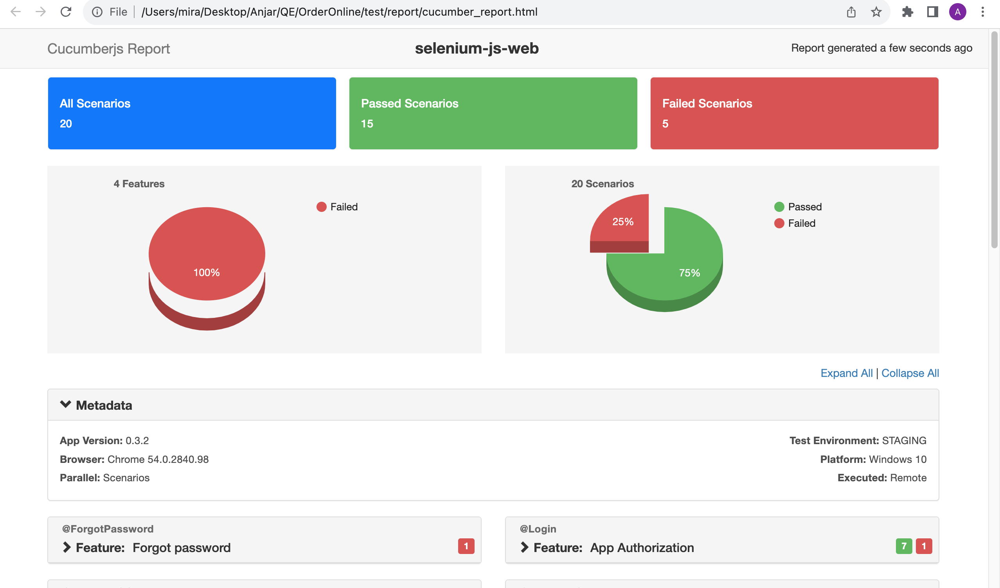

# Selenium and CucumberJS Web Automation 🌐

Web Automation Testing using Cucumber-js + Selenium 🚀



## Description 📄

This project is a web automation testing framework using Cucumber.js and Selenium WebDriver. It runs tests in headless mode by default, but you can modify this behavior through an environment variable.

## Table of Contents 📋

- [Installation](#installation) 🛠️
- [Usage](#usage) 🚀
- [Scripts](#scripts) 📜
- [Generating HTML Report](#generating-html-report) 📊
- [Modifying Headless Mode](#modifying-headless-mode) 💻
- [Contact](#contact) 📧
- [Contributing](#contributing) 🤝
- [License](#license) 📝
- [Author](#author) 👨‍💻

## Installation 🛠️

1. Clone the repository:
   ```bash
   git clone https://github.com/your-username/selenium-js-web.git
   ```

2. Install the project dependencies:
   ```bash
   npm install
   ```

## Usage 🚀

You can use this framework to perform web automation testing for various scenarios.

## Scripts 📜

### Run All Tests ▶️

To run all tests and generate a JSON report:

```bash
npm test
```

### Run Registration Tests for Corporate Users 🏢

To run registration tests for corporate users:

```bash
npm run test:register-corp
```

### Run Registration Tests for Regular Users 👤

To run registration tests for regular users:

```bash
npm run test:register-user
```

### Run Forgot Password Tests 🔑

To run forgot password tests:

```bash
npm run test:forgot
```

### Debug Tests 🐞

To run tests in debug mode (only scenarios tagged as @Only):

```bash
npm run debug
```

## Generating HTML Report 📊

If you want to see the report in HTML, run the following command:

```bash
node index.js
```

## Copy Env Variable

Contact me for env variable needed

## Test Result example

[Test Result Example](img/ss1.png) 
[Test Result Example](img/ss2.png) 
[Test Result Example](img/ss3.png)

## Modifying Headless Mode 💻

By default, tests run in headless mode. You can modify this behavior using the `HEADLESS` environment variable:

```bash
# To run tests in non-headless mode
HEADLESS=FALSE npm test

# To run tests in headless mode (default)
HEADLESS=TRUE npm test
```

## Future Update 🚀

I'm planning to add parallel test for faster execution

## Contact 📧

If you need assistance or have questions about configuring environment variables or any other aspects of this project, please don't hesitate to contact me.

## Contributing 🤝

If you'd like to contribute to this project, please follow these guidelines:

1. Fork the repository.
2. Create a new branch for your feature or bugfix.
3. Make your changes and commit them.
4. Push your changes to your fork.
5. Submit a pull request to the main repository.

## License 📝

This project is licensed under the ISC License. See the [LICENSE](LICENSE) file for details.

## Author 👨‍💻

- Author: Anjar Tiyo Saputro